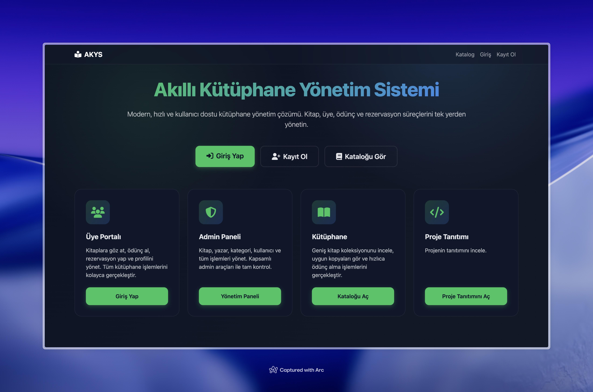
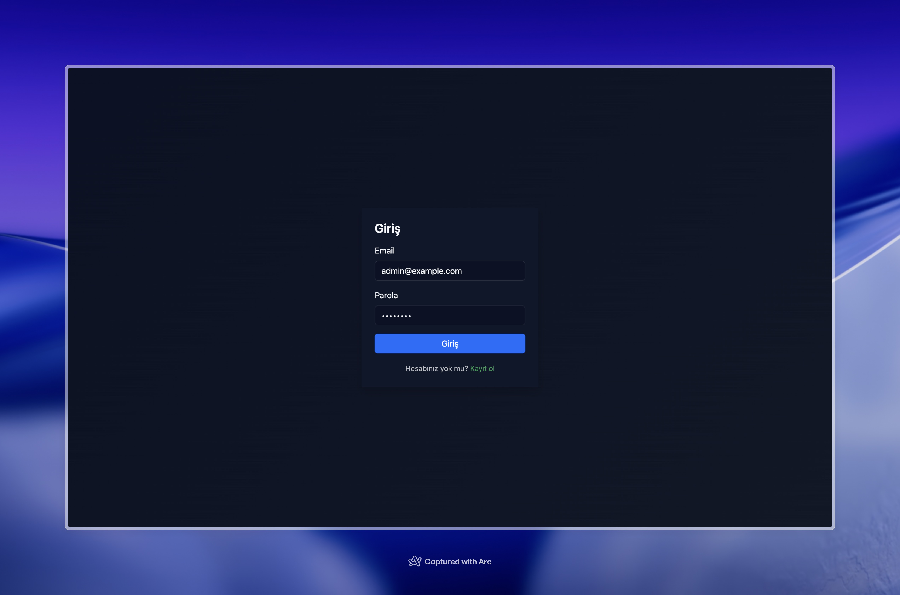
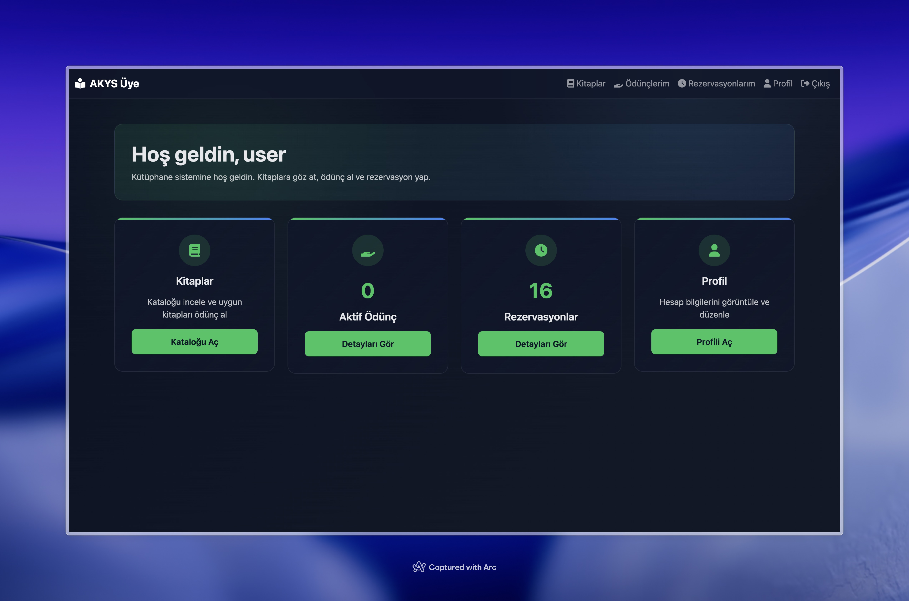
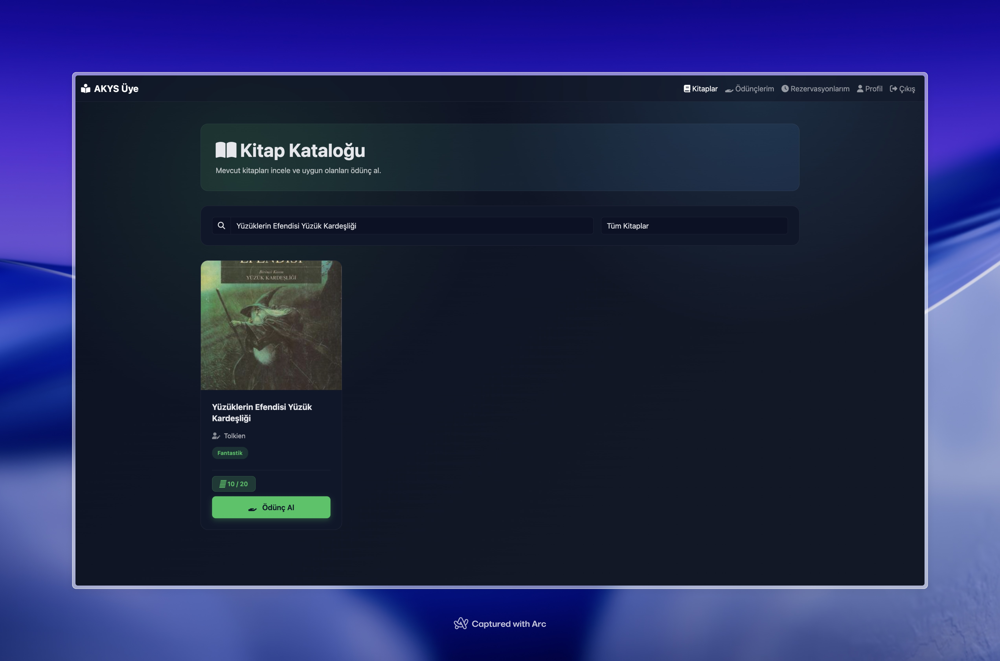
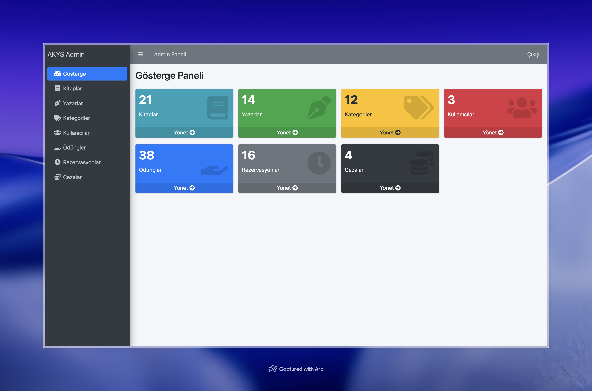
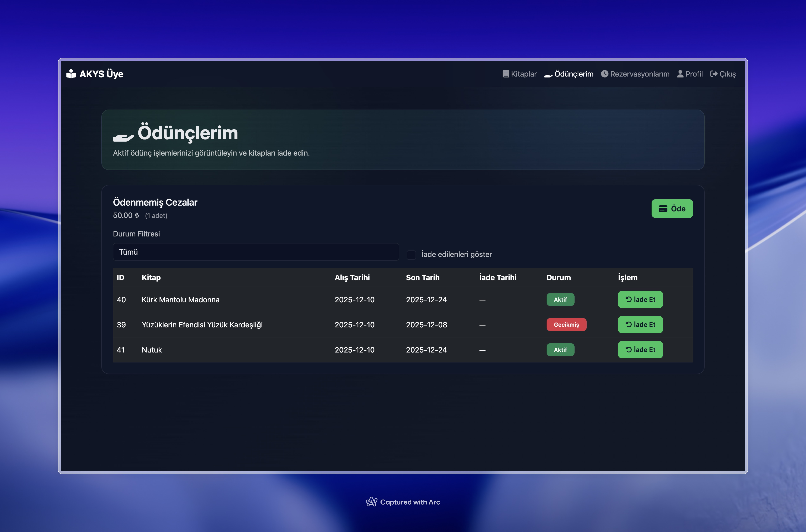

# 📚 Akıllı Kütüphane Yönetim Sistemi

Modern ve kullanıcı dostu bir kütüphane yönetim sistemi. Bu proje ile kütüphane işlemlerinizi dijital ortamda kolayca yönetebilirsiniz.



## 📋 İçindekiler

- [Özellikler](#-özellikler)
- [Kullanılan Teknolojiler](#-kullanılan-teknolojiler)
- [Önkoşullar](#-önkoşullar)
- [Kurulum](#-kurulum)
- [Kullanım](#-kullanım)
- [Ekran Görüntüleri](#-ekran-görüntüleri)

## ✨ Özellikler

- 👤 Kullanıcı yönetimi ve kimlik doğrulama
- 📖 Kitap katalog yönetimi
- 📝 Ödünç alma ve iade işlemleri
- 🔖 Kitap rezervasyon sistemi
- 💰 Gecikme cezası takibi
- 📊 Admin paneli ve raporlama
- 🔍 Gelişmiş arama ve filtreleme
- 🔒 JWT tabanlı güvenli kimlik doğrulama

## 🛠️ Kullanılan Teknolojiler

### Frontend


### Backend


### Database


### Build Tool


## Gereksinimler
- **Java JDK 17** veya üzeri
- **Maven 3.6+**
- **PostgreSQL 13** veya üzeri
## 🚀 Kurulum

### 1. Repository'yi Klonlayın

```bash
git clone https://github.com/yagizengin/AkilliKutuphaneYonetimSistemi.git
cd AkilliKutuphaneYonetimSistemi
```

### 2. Veritabanını Oluşturun

PostgreSQL'de yeni bir veritabanı oluşturun:

```sql
CREATE DATABASE akys;
```

### 3. Uygulama Yapılandırmasını Düzenleyin

`application.properties` dosyasını açın ve veritabanı bilgilerinizi güncelleyin.

```properties
spring.datasource.url=jdbc:postgresql://localhost:5432/akys
spring.datasource.username=kullanici_adiniz
spring.datasource.password=sifreniz
```
### 4. Gerekli Tabloları ve Varsayılan kullanıcıyı oluşturun
Veritabanina gerekli tablolari ve varsayilan kullaniciyi eklemek icin PostgreSQL içinde:
```bash
\i src/main/resources/db/database_init.sql
```
### 4. Trigger'ları Yükleyin

Veritabanına trigger'ları eklemek için PostgreSQL içinde:

```bash
\i src/main/resources/db/triggers.sql
```

### 5. Uygulamayı Çalıştırın

```bash
mvn spring-boot:run
```

### 6. Tarayıcıda Açın

Uygulama başlatıldıktan sonra tarayıcınızda şu adresi açın:

```
http://localhost:8080
```

## 💻 Kullanım

### Varsayılan Kullanıcı

Sistem ilk kurulumda aşağıdaki varsayılan kullanıcıyı içerir:

- E-mail: `admin@example.com`
- Şifre: `admin123`

### Ana Özellikler

1. **Kullanıcı Paneli:**
   - Kitap arama ve görüntüleme
   - Kitap rezervasyonu yapma
   - Aktif ödünç alınan kitapları görüntüleme
   - Profil yönetimi

2. **Admin Paneli:**
   - Kullanıcı yönetimi
   - Kitap, yazar ve kategori yönetimi
   - Ödünç verme işlemleri
   - Gecikme cezası takibi
   - Sistem raporları

## 📸 Ekran Görüntüleri

### Ana Sayfa


### Giriş Sayfası


### Kullanıcı Paneli


### Kitap Listesi


### Admin Paneli


### Ödünç İşlemleri



<div align="center">
  
[Yağız Engin](https://github.com/yagizengin)

</div>
